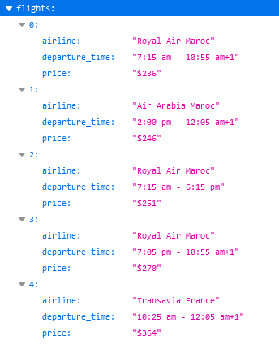

<h1>Flight API - Find Cheap Flights in Morocco</h1>

This is a web scraper built with Node.js and Puppeteer to retrieve the cheap flights information.

<h2>Installation</h2>

Before running the application, make sure you have Node.js and npm installed on your machine.

<h4>Clone the repository</h4>
<pre><code>git clone https://github.com/XredaX/flights-api.git</code></pre>

<h4>Navigate to the project directory</h4>
<pre><code>cd flights-api</code></pre>

<h4>Install dependencies</h4>
<pre><code>npm install</code></pre>

<h2>Usage</h2>

To start the server, run the following command:

<pre><code>npm run start</code></pre>

Once the server is running, you can access the API endpoint to retrieve flight information.

<h3>API Endpoint</h3>

<strong>GET</strong> <code>/flights</code>

Query Parameters:

<ul>
  <li><code>from</code>: Departure airport name</li>
  <li><code>to</code>: Arrival airport name</li>
  <li><code>date</code>: Departure date in yyyy-mm-dd format</li>
</ul>

Example Request:

<pre>
  <code>
    http://localhost:4000/flights?from=Oujda&to=Rabat&date=2024-07-15
  </code>
</pre>

Make sure to change the configuration to match your setup

The Result:

<h2>Dependencies</h2>
<ul>
  <li>express</li>
  <li>puppeteer-extra</li>
  <li>puppeteer-extra-plugin-stealth</li>
  <li>fs</li>
  <li>path</li>
  <li>date-fns</li>
  <li>dotenv</li>
</ul>

